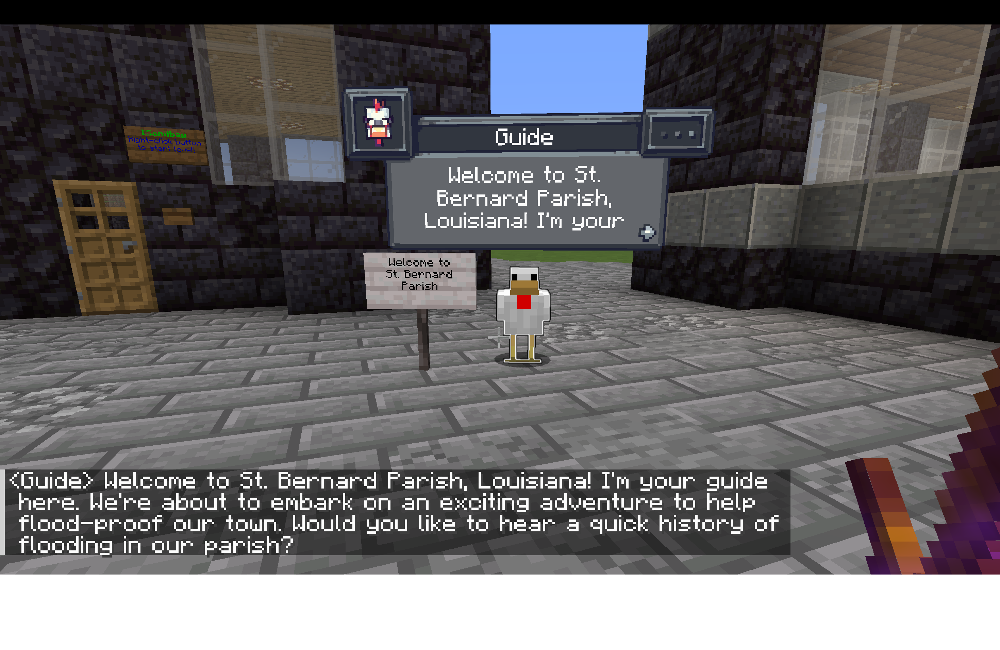

# FloodCraft
### An Educational Flood Mitigation Game for K-12 Students in Minecraft

Developed by the [Hydroinformatics Lab (IHILab) at Tulane University](https://hydroinformatics.tulane.edu/)  
*Originally developed in collaboration with the University of Iowa Hydroinformatics Lab (UIHI Lab)*

⭐ **If you find FloodCraft helpful for your classroom or research, please consider giving this repository a star!**

---

<div align="center">
    
</div>

---

## Table of Contents
- [About the Game](#about-the-game)
- [Core Learning Topics](#core-learning-topics)
  - [🛡️ Flood Mitigation Strategies](#️-flood-mitigation-strategies)
  - [🤖 AI Guide Chicken](#-ai-guide-chicken)
  - [🌊 Real-World Game Worlds](#-real-world-game-worlds)
- [Game Worlds & Levels](#game-worlds--levels)
  - [📍 World 1: St. Bernard Parish, Louisiana](#-world-1-st-bernard-parish-louisiana)
  - [📍 World 2: Greenville, Mississippi](#-world-2-greenville-mississippi)
- [Quick Level Reference](#quick-level-reference)
- [How the Game Works](#how-the-game-works)
- [How to Install](#how-to-install)
  - [Prerequisites](#prerequisites)
  - [Installation of Fabric and Required Mods](#installation-of-fabric-and-required-mods)
  - [Install Building & Block Mods (BlockMods.zip)](#install-building--block-mods-blockmodszip)
  - [Download and Install the World Folders](#download-and-install-the-world-folders)
- [Feedback & Contributing](#feedback--contributing)
- [Acknowledgements](#acknowledgements)
- [Citation](#citation)

---

## About the Game

**FloodCraft** is an educational game built in Minecraft that teaches K-12 students how to protect homes and towns from flooding. Players learn practical flood mitigation strategies by tackling fun, hands-on challenges across real-world locations.

The game combines custom Minecraft worlds, built-in flood simulations, and an interactive **AI Guide Chicken** (powered by CreatureChat and Google Gemini) that explains flood history, gives level directions, and answers students' questions in child-friendly language.

---

## Core Learning Topics

### 🛡️ Flood Mitigation Strategies
Students practice real flood protection methods in interactive challenges:

| Strategy | What You Learn | In-Game Activity |
| :--- | :--- | :--- |
| **Sandbagging** | How temporary barriers hold back rising water | Place sandbag blocks around houses to seal off water leaks. |
| **Storm Drains** | Why clean drainage matters during heavy rains | Clear leaves and trash from blocked storm drains to drain flooded streets. |
| **Moving Valuables** | How elevating belongings reduces flood damage | Move household furniture and appliances upstairs before the ground floor floods. |
| **Spillway Gates** | How dams and spillways control river levels | Clear underwater blockages and operate generator controls to open floodgates. |
| **Search & Rescue** | How communities evacuate during flood emergencies | Rescue stranded pets and citizens by boat and bring them to safety. |
| **Relief Supplies** | How emergency relief camps support displaced families | Deliver food and clean water rations to residents in temporary tents. |

---

### 🤖 AI Guide Chicken
Students can talk directly to an in-game guide chicken powered by Google Gemini:

* **Friendly Explanations**: Explains how each flood protection method works in simple terms.
* **Real History**: Shares stories about major floods (like the 1927 Mississippi River flood and Hurricane Katrina).
* **Help & Directions**: Guides players through level goals and answers questions about flooding.

---

### 🌊 Real-World Game Worlds
Each world is based on a real community with a history of flooding:

| World | Location | Real-World Flood Type |
| :--- | :--- | :--- |
| **St. Bernard Parish** | Louisiana | Hurricane storm surge and coastal levee flooding (inspired by Hurricane Katrina in 2005). |
| **Greenville** | Mississippi | Massive river flooding and levee breaks (inspired by the Great Mississippi Flood of 1927). |

---

## Game Worlds & Levels

```
How Each Level Works:
 ┌─────────────────┐       ┌─────────────────┐       ┌─────────────────┐
 │ 1. Talk to the  │ ───►  │ 2. Build or Fix │ ───►  │ 3. Watch the    │
 │    Guide Chicken│       │    Your Defense │       │    Water Rise   │
 └─────────────────┘       └─────────────────┘       └─────────────────┘
                                                              │
 ┌─────────────────┐       ┌─────────────────┐                ▼
 │ 5. Level Resets │ ◄───  │ 4. Check if the │ ◄──────────────┘
 │    or You Win!  │       │    House Stayed │
 └─────────────────┘       │    Dry          │
                           └─────────────────┘
```

---

### 📍 World 1: St. Bernard Parish, Louisiana
Based on coastal Louisiana, where hurricane storm surges push water over levees and into neighborhoods.

```
Level Progression:
 [Level 1: Sandbag Defense] ──► [Level 2: Storm Drains] ──► [Level 3: Wildlife Rescue] 
                                                                    │
 [Level 5: Spillway Repair] ◄── [Level 4: Save the Furniture] ◄─────┘
```

* **Level 1: Sandbag Defense**  
  * **Goal**: Water is rising toward a house! Find the 5 open gaps around the yard and place sandbags to seal the perimeter before water floods in.
  * **What you learn**: How sandbag walls block floodwaters and how stacking sandbags properly keeps water out.

* **Level 2: Storm Drains**  
  * **Goal**: Leaves and debris are clogging the street storm drains, causing the neighborhood to flood. Use shears to clear all 5 glowing clogged drains so water can flow away.
  * **What you learn**: Why keeping drains clean is one of the easiest ways to stop street flooding.

* **Level 3: Wildlife Rescue**  
  * **Goal**: Floodwaters are filling the Jean Lafitte swamp. Find two stranded family pets (a cat and a dog), put them on a leash, and lead them across the bridge to the safety pen before the timer runs out.
  * **What you learn**: How important it is to have an evacuation plan for pets during storms.

* **Level 4: Save the Furniture**  
  * **Goal**: Water has entered the first floor of a house. Grab your pickaxe, collect 12 important household items (beds, furnace, crafting table, bookshelves, and armor stand), and store them safely in the upstairs chest.
  * **What you learn**: Moving valuables and electrical items to higher floors prevents costly flood damage.

* **Level 5: Spillway Repair**  
  * **Goal**: A nearby reservoir is overflowing and threatening the town. Swim down to clear 3 blockages from the spillway gate, grab a spare cogwheel to fix the control panel, flip the generator switch, and pull the lever to open the floodgates!
  * **What you learn**: How spillways and dams release high water safely during emergencies.

---

### 📍 World 2: Greenville, Mississippi
Based on the Mississippi Delta, where heavy rains can overwhelm river levees.

```
Level Progression:
 [Level 1: Save the Furniture] ──► [Level 2: Storm Drains] ──► [Level 3: Sandbag Defense] 
                                                                       │
 [Level 5: Relief Camp] ◄───────── [Level 4: Tent City Rescue] ◄───────┘
```

* **Level 1: Save the Furniture**  
  * **Goal**: Rising river water is heading toward town. Quickly move household furniture and equipment up to the attic before water comes through the doors.
  * **What you learn**: Acting fast to move items to higher ground protects belongings from rising water.

* **Level 2: Storm Drains**  
  * **Goal**: Paved city streets are flooded with stormwater runoff. Locate blocked drains around town and clear them out to reopen the drainage system.
  * **What you learn**: How stormwater runoff travels across streets and why clear drains prevent street flooding.

* **Level 3: Sandbag Defense**  
  * **Goal**: Water is starting to spill over the riverbanks. Stack sandbags around the building perimeter to hold back the floodwaters.
  * **What you learn**: How emergency sandbag barriers protect public buildings when water levels rise.

* **Level 4: Tent City Rescue**  
  * **Goal**: A river levee broke and flooded the fields. Row a rescue boat through the flooded water to locate 4 stranded citizens and bring them safely to the high-ground tents.
  * **What you learn**: How emergency teams use boats to evacuate people stranded by broken levees.

* **Level 5: Relief Camp**  
  * **Goal**: Evacuated residents are resting in tents at the relief camp. Pick up food and water rations from the main supply table and deliver them to all 4 residents.
  * **What you learn**: How communities organize food, clean water, and shelter for families displaced by disasters.

---

## Quick Level Reference

| World | Level | Challenge | Main Task |
| :--- | :---: | :--- | :--- |
| **St. Bernard Parish** | 1 | **Sandbag Defense** | Place sandbags around house perimeter to block water |
| **St. Bernard Parish** | 2 | **Storm Drains** | Clear 5 clogged drains using shears |
| **St. Bernard Parish** | 3 | **Wildlife Rescue** | Leash and guide stranded pets across the bridge |
| **St. Bernard Parish** | 4 | **Save the Furniture** | Move 12 household items to the upstairs chest |
| **St. Bernard Parish** | 5 | **Spillway Repair** | Clear gate blockages, fix controls, and open spillway |
| **Greenville** | 1 | **Save the Furniture** | Move furniture and tools upstairs to safety |
| **Greenville** | 2 | **Storm Drains** | Clear street drain blockages to lower ponded water |
| **Greenville** | 3 | **Sandbag Defense** | Build a sandbag wall around the house |
| **Greenville** | 4 | **Tent City Rescue** | Row a boat to rescue 4 stranded citizens |
| **Greenville** | 5 | **Relief Camp** | Deliver food and clean water rations to tent residents |

---

## How the Game Works

FloodCraft uses standard Minecraft features paired with a few lightweight mods to make setup as simple as possible:

| Component | What It Does |
| :--- | :--- |
| **Minecraft 1.21.4 (Fabric)** | The base game version. |
| **Fabric API** | Required helper library for Fabric mods. |
| **Easy NPC & Config UI** | Creates the in-game guide characters and handles player interactions. |
| **CreatureChat** | Lets players talk directly to the Guide Chicken using AI. |
| **Datapacks** | Controls the game rules, timer countdowns, floodwater rises, and resets (no coding needed from players). |
| **Resource Pack** | Adds custom sandbag and floodwall textures directly inside the world save. |

---

### How to Install

If you would like to play the game, please follow the setup instructions below.

**Prerequisites:** 
- Java Development Kit (JDK) 21 (required for Minecraft 1.21.4)
- Minecraft Java Edition (Version 1.21.4)
- Fabric Loader (Version 0.19.3 or latest for 1.21.4)

You can find tutorials on YouTube for installing these prerequisites on your computer. Below are some links, but feel free to search for other tutorials specific to your operating system:
- [Minecraft Java Installation on MacOS](https://www.youtube.com/watch?v=USKdqHp3Glg)
- [Minecraft Java Installation on Other Systems](https://www.youtube.com/watch?v=V-3dlZsB0dw)

#### Installation of Fabric and Required Mods
1. Install Fabric Loader for Minecraft 1.21.4 using the installer from the Fabric website.
   - [Link to Fabric Loader] (https://fabricmc.net)
3. Locate the minecraft folder on your computer (or your launcher instance's directory), then navigate to the `mods` folder inside it.
4. Place the following required mods (compatible with Minecraft 1.21.4) into the `mods` folder:
   - **Fabric API** (Download from CurseForge or Modrinth)
   - **CreatureChat** (Provides the AI-powered NPC interactions, compatible with 1.21.4)
   - **Easy NPC and Easy NPC Config UI** (Handles custom guide NPCs, compatible with 1.21.4)

#### Install Building & Block Mods (BlockMods.zip)
To ensure the custom structures and items in the maps render correctly, you must download `BlockMods.zip` from this repository. Extract the contents of `BlockMods.zip` and place the following mods inside your `mods` folder:
- **Macaw's Roofs (mcw-roofs)** – Used for tent shapes.
- **Comforts** – Adds sleeping bags used in the levels.
- **BigSignWriter & AddonsLib** – Adds the custom large lettering/signs in the world.

#### Download and Install the World Folders
Locate the world folders inside the `minecraft/saves` directory of this repository:
- **Greenville Backup 5** (Greenville Map)
- **St. Bernard Parish** (Saint Bernard Parish Map)

Copy both folders and paste them inside the `saves` folder located in your local Minecraft instance directory.

When you open the game, you will see both worlds in your Singleplayer world list. Select the world you want to play and begin!

---

## Feedback & Contributing

FloodCraft is an open-source educational project and we welcome ideas, feedback, and contributions!

* 💡 **Report a bug or suggest an idea**: Open an issue on our [GitHub Issues](https://github.com/uihilab/floodcraft/issues) page.
* 🏫 **Use it in your classroom**: Are you an educator using FloodCraft? [Reach out to us](https://hydroinformatics.tulane.edu/)—we would love to hear how your students liked it!

---

## Acknowledgements

FloodCraft is developed and maintained by the **Hydroinformatics Lab (HILab)** at **Tulane University**, in collaboration with the **University of Iowa Hydroinformatics Lab (UIHI Lab)**:  
🔗 [https://hydroinformatics.tulane.edu/](https://hydroinformatics.tulane.edu/)

---

## Citation

Emiroglu, E., Grant, C. A., Sermet, Y., & Demir, I. (2025). Floodcraft: Game-based Interactive Learning Environment using Minecraft for Flood Mitigation for K-12 Education. *International Journal of Disaster Risk Reduction*, 130, 105799. [https://doi.org/10.1016/j.ijdrr.2025.105799](https://doi.org/10.1016/j.ijdrr.2025.105799)

---

<div align="center">
  <sub>FloodCraft · Hydroinformatics Lab at Tulane University · Open Source · Educational Gaming</sub>
</div>

